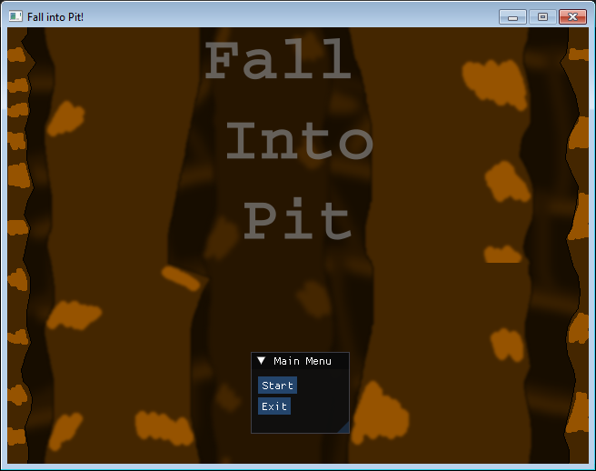
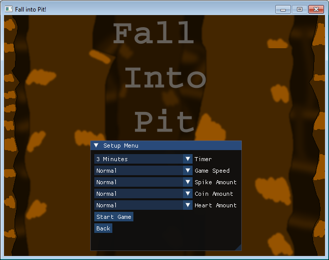
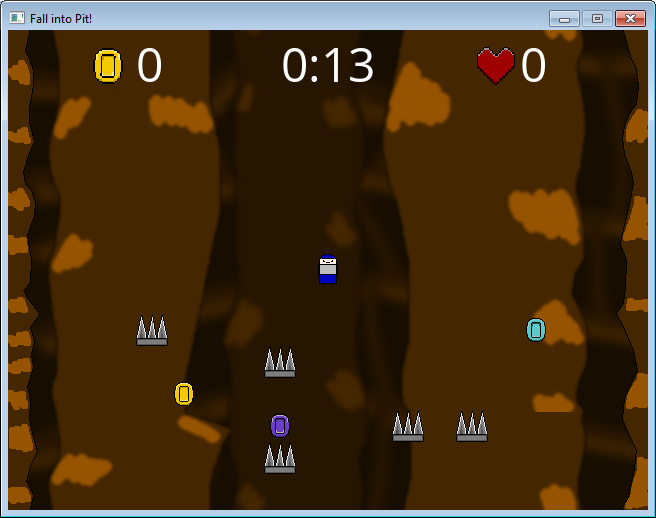
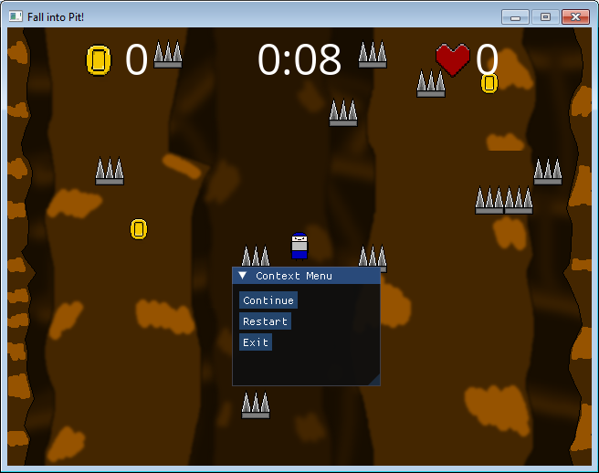

# Fall into Pit

Fall into Pit is a simple little game that I've been working on for the past couple of weeks. The reason why I'm working on 
this project instead of working on DSGE is because something felt off when working on. I decided to work on a small game project
to understand what I was missing and I think I figured it out. I wasn't working on game along side of DSGE which was my issue. 
This is why this project exists. The goal is to get this game finished and take its source code and reporpose it for another game and keep doing it until I have a general purpose game engine... Maybe. Who knows!

So what is "Fall into Pit?" Basically its a little game were you are falling into a bit and you'll have to dodge spikes to survive, collect coins to get a better score, and collect hearts to keep yourself alive. Thats pretty much the basic gameplay loop. 

The goal is to create a complete game were there will be more areas then the one on display. Get the game a full release on itch.io and get a webassembly build working for now. That my current goals. The other goal is to try
and keep this game small so I can get it released. The game will also be opensource under the good old [MIT](LICENSE).

Oh, I did forget to share this trivia. This game is based on a Trijam 13 theme "Falling in [blank] <- you pick" which what imspired me to create this little game project. I'm also going to give a bit of advice when coming up with a simple game project. If your having trouble coming up with an idea for a game take a look at some of the game jam themes from Trijam or other game jams for insperation. If usally get quite a bit of fun gameplay ideas by simply writing the game jam theme and writing ideas about it on paper first before even touching the keyboard. Its actually bit of a pychological trick because when your writing your ideas down you'll gain insight due to kinematic learning. I've written so many notebooks for the past few years that I can probably fill a bookshelf with them. 

Copyright 2024-2025 Frederick R. Cook

Permission is hereby granted, free of charge, to any person obtaining a copy of this software and associated documentation files (the “Software”), to deal in the Software without restriction, including without limitation the rights to use, copy, modify, merge, publish, distribute, sublicense, and/or sell copies of the Software, and to permit persons to whom the Software is furnished to do so, subject to the following conditions:

The above copyright notice and this permission notice shall be included in all copies or substantial portions of the Software.

THE SOFTWARE IS PROVIDED “AS IS”, WITHOUT WARRANTY OF ANY KIND, EXPRESS OR IMPLIED, INCLUDING BUT NOT LIMITED TO THE WARRANTIES OF MERCHANTABILITY, FITNESS FOR A PARTICULAR PURPOSE AND NONINFRINGEMENT. IN NO EVENT SHALL THE AUTHORS OR COPYRIGHT HOLDERS BE LIABLE FOR ANY CLAIM, DAMAGES OR OTHER LIABILITY, WHETHER IN AN ACTION OF CONTRACT, TORT OR OTHERWISE, ARISING FROM, OUT OF OR IN CONNECTION WITH THE SOFTWARE OR THE USE OR OTHER DEALINGS IN THE SOFTWARE.

